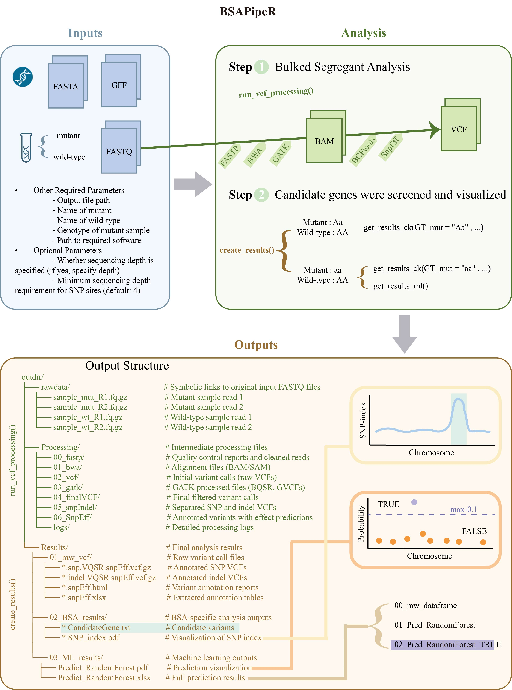

<!-- README.md is generated from README.Rmd. Please edit that file -->

# BSAPipeR

[](https://www.gnu.org/licenses/gpl-3.0)

BSAPipeR is an integrated R package for Bulked Segregant Analysis (BSA)
that provides a complete workflow from raw sequencing data to candidate
variant identification.

<figure>

<figcaption aria-hidden="true"></figcaption>
</figure>

## Installation

Install the development version from GitHub:

``` r
 # Install required packages
 install.packages(c('optparse', 'data.table', 'doParallel', 'dplyr', 'foreach', 'tidyr', 'vcfR', 'CMplot', 'XML', 'furrr', 'future', 'ggplot2', 'magrittr', 'openxlsx', 'purrr', 'workflowsets'))
 # Install BSAPipeR from GitHub
 wget https://github.com/ZHUHJ2023/BSAPipeR/blob/main/BSAPipeR_0.1.0.tar.gz
 # Install the package
 install.packages("BSAPipeR_0.1.0.tar.gz",dependencies=T)
```

## Complete BSA Pipeline

The `BSAPipeR()` function provides a one-step solution for BSA analysis:

``` r
# Load the BSAPipeR package
library(BSAPipeR)

# First configure software paths
set_software_paths(
  bwa = "/path/to/bwa", # bwa-0.7.17
  fastp = "/path/to/fastp", # fastp-0.23.2
  samtools = "/path/to/samtools", # samtools-1.17
  picard = "/path/to/java -XX:ParallelGCThreads=8 -Xmx30g -jar /path/to/picard.jar", # picard-3.1.1
  bcftools = "/path/to/bcftools", # bcftools-1.8
  gatk = "/path/to/java -XX:ParallelGCThreads=8 -Xmx30g -jar /path/to/gatk.jar", # gatk-4.4.0.0
  snpEff = "/path/to/snpEff", #SnpEff directory, SnpEff-4.3t 
  java = "/path/to/java", # jdk-18.0.2.1
  pandepth = "/path/to/pandepth" # PanDepth-2.25
)

# View the current configured software path
get_software_paths()

# Run complete pipeline
BSAPipeR(
  ref = "/path/to/reference.fa",
  refbwa = "/path/to/bwa_index_prefix",
  outdir = "/path/to/output_directory",
  sample_mut = "mutant",
  sample_wt = "wildtype",
  GFF3 = "/path/to/annotation.gff3",
  mutfq1 = "mutant_R1.fq.gz",
  mutfq2 = "mutant_R2.fq.gz",
  wtfq1 = "wildtype_R1.fq.gz",
  wtfq2 = "wildtype_R2.fq.gz",
  depthFT = "True", # Whether to specify the sequencing depth
  mdepth = 10, # If the sequencing depth is specified, specify what the sequencing depth is
  GT_mut = "aa", # Expected mutant genotype (aa for homozygous)
  mindp = 4 # The minimum depth threshold can be adjusted as needed
)
```

## simple usage

1. for fastq data
``` bash
# Download the bsapipe.r file
# create a software_paths.config file
echo "bwa = '/path/to/bwa'
fastp = '/path/to/fastp'
samtools = '/path/to/samtools'
picard = '/path/to/java -XX:ParallelGCThreads=8 -Xmx30g -jar /path/to/picard.jar'
bcftools = '/path/to/bcftools'
gatk = '/path/to/java -XX:ParallelGCThreads=8 -Xmx30g -jar /path/to/gatk.jar'
snpEff = '/path/to/snpEff'
java = '/path/to/java'
pandepth = '/path/to/pandepth' " > software_paths.config
# Run BSAPipeR
Rscript bsapipe.r --input_type=fastq --ref=/path/to/reference.fa --refbwa=/path/to/bwa_index_prefix --mutfq1=mutant_R1.fq.gz --mutfq2=mutant_R2.fq.gz --wtfq1=wildtype_R1.fq.gz --wtfq2=wildtype_R2.fq.gz --gff3=/path/to/annotation.gff3 --outdir=results --sample_mut=mutant --sample_wt=wildtype --GT_mut=aa --mindp=4 --config=software_paths.config
```

2. for vcf data
``` bash
Rscript bsapipe.r --input_type=vcf --snp_vcf=chr9.8820M.snp.VQSR.snpEff.vcf --outdir=./ --sample_mut=8820M --sample_wt=B73QL --GT_mut=aa --mindp=4
```

## Pipeline Workflow

The package implements a comprehensive BSA analysis workflow:

1.  **Data Preparation**
    - Creates symbolic links to input FASTQ files
    - Organizes raw data in `rawdata/` directory
2.  **Variant Calling Pipeline**
    - Quality control (fastp)
    - Read alignment (bwa)
    - Duplicate marking (picard)
    - Variant calling (GATK/bcftools)
    - Base quality recalibration (GATK)
    - Variant filtering
    - Organized output in `Processing/` directory
3.  **Variant Annotation**
    - Functional annotation with snpEff
4.  **Result Generation**
    - Candidate variant identification
    - Summary statistics
    - Visualization plots
    - Organized output in `Results/` directory

## Key Parameters

| Parameter    | Description                                     |
|--------------|-------------------------------------------------|
| `ref`        | Reference genome FASTA file                     |
| `refbwa`     | BWA index prefix (will create if doesn’t exist) |
| `outdir`     | Output directory (will create subdirectories)   |
| `sample_mut` | Mutant pool sample name                         |
| `sample_wt`  | Wild-type pool sample name                      |
| `GFF3`       | Genome annotation file                          |
| `depthFT`    | Enable depth filtering (“True”/“False”)         |
| `mdepth`     | Minimum depth threshold when depthFT=“True”     |
| `GT_mut`     | Expected mutant genotype (“aa” for homozygous)  |
| `mindp`      | Minimum depth for variant filtering (default=4) |

## Output Structure

    outdir/
    ├── rawdata/                  # Symbolic links to original input FASTQ files
    │   ├── sample_mut_R1.fq.gz   # Mutant sample read 1
    │   ├── sample_mut_R2.fq.gz   # Mutant sample read 2
    │   ├── sample_wt_R1.fq.gz    # Wild-type sample read 1
    │   └── sample_wt_R2.fq.gz    # Wild-type sample read 2
    │
    ├── Processing/               # Intermediate processing files
    │   ├── 00_fastp/             # Quality control reports and cleaned reads
    │   ├── 01_bwa/               # Alignment files (BAM/SAM)
    │   ├── 02_vcf/               # Initial variant calls (raw VCFs)
    │   ├── 03_gatk/              # GATK processed files (BQSR, GVCFs)
    │   ├── 04_finalVCF/          # Final filtered variant calls
    │   ├── 05_snpIndel/          # Separated SNP and indel VCFs
    │   ├── 06_SnpEff/            # Annotated variants with effect predictions
    │   └── logs/                 # Detailed processing logs
    │
    └── Results/                  # Final analysis results
        ├── 01_raw_vcf/           # Raw variant call files
        │   ├── *.snp.VQSR.snpEff.vcf.gz    # Annotated SNP VCFs
        │   ├── *.indel.VQSR.snpEff.vcf.gz  # Annotated indel VCFs
        │   ├── *.snpEff.html     # Variant annotation reports
        │   └── *.snpEff.xlsx     # Extracted annotation tables
        │
        ├── 02_BSA_results/       # BSA-specific analysis outputs
        │   ├── *.CandidateGene.xlsx       # Candidate variants
        │   └── *.SNP_index.pdf          # Visualization of SNP index
        │
        └── 03_ML_results/        # Machine learning outputs
            ├── Predict_RandomForest.xlsx  # Full prediction results
            └── Predict_RandomForest.pdf   # Prediction visualization


## Getting Help

For documentation:

``` r
?BSAPipeR
?set_software_paths
```

To report issues:  
<https://github.com/ZHUHJ2023/BSAPipeR/issues>

## Citation

Please cite this work as:  
\[Your Name\]. (Year). BSAPipeR: An integrated BSA analysis pipeline.
\[URL\]

## License

GPL-3 © \[Your Name\]


